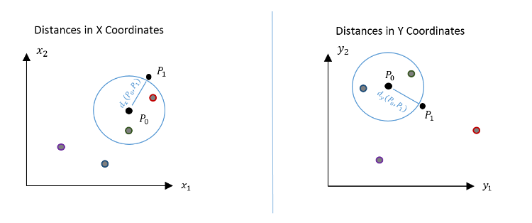

---
output:
  html_document:
    number_sections: yes
    toc: yes
    css: style.css
  pdf_document:
    latex_engine: xelatex
    toc: yes
---
<!--
rmarkdown v1
%\VignetteEngine{knitr::rmarkdown}
%\VignetteIndexEntry{HHG}
-->
---
title: "The HHG Package - Multivariate and Univariate  non-parametric Independence and K-Sample tests"
author: "Barak Brill, barakbri@mail.tau.ac.il"
date: "Monday, July 13, 2015"
output:
  html_document:
    keep_md: yes
--- 

```{r echo=FALSE}
set.seed(2)
```
#Quick start#
This package contains tests for independence, i.e., for discovering whether 
two random variables (univariate or multivariate) are dependent, as well as for   equality of distributions (also known as the K-sample problem), i.e., for discovering whether the distribution is not the same across $K$ ($K\geq2$) groups.

The hhg.univariate tests can be used for both the K-sample problem and independence testing in a univariate setting.

The functions hhg.test, hhg.test.k.sample, hhg.test.2.sample can be used in both a univariate and multivariate setting.

The following examples use the default parameters:

##Quick start: univariate independence example##

Data generation and using two univariate tests: the combined independence test on the ADP statistic, and the HHG test:
```{r, eval=FALSE}

N = 30
data = hhg.example.datagen(N, 'Parabola')
X = data[1,]
Y = data[2,]
plot(X,Y)

#Option 1: Perform the ADP combined test
#using partitions sizes up to 4. see documentation for other parameters of the combined test 
#(it is recommended to use mmax >= 4, or the default parameter for large data sets)
combined = hhg.univariate.ind.combined.test(X,Y,nr.perm = 200,mmax=4)
combined


#Option 2: Perform the hhg test:

## Compute distance matrices, on which the HHG test will be based
Dx = as.matrix(dist((X), diag = TRUE, upper = TRUE))
Dy = as.matrix(dist((Y), diag = TRUE, upper = TRUE))

hhg = hhg.test(Dx, Dy, nr.perm = 1000)

hhg

```

##Quick start: univariate K-sample example##
Data generation and using two univariate tests: the combined K-sample test on the Sm statistic, and the hhg test for K samples:

```{r, eval=FALSE}

N0=50
N1=50
X = c(c(rnorm(N0/2,-2,0.7),rnorm(N0/2,2,0.7)),c(rnorm(N1/2,-1.5,0.5),rnorm(N1/2,1.5,0.5)))
Y = (c(rep(0,N0),rep(1,N1)))
#plot the two distributions by group index (0 or 1)
plot(Y,X)


#Option 1: Perform the Sm combined test


combined.test = hhg.univariate.ks.combined.test(X,Y)
combined.test


#Option 2: Perform the hhg K-sample test:


Dx = as.matrix(dist(X, diag = TRUE, upper = TRUE))

hhg = hhg.test.k.sample(Dx, Y, nr.perm = 1000)

hhg


```

##Quick start: multivariate independence example##
Data generation and using the hhg multivariate independence test.

The following code generates a random sample of size $n=30$. The $X$ vectors are of dimension 5, and are sampled from a multivariate normal distribution. The $Y$ vectors, also of dimension 5, are defined by $Y_j = X_j + 4 X_j^2 +\epsilon_j$, for $j=1,2$,  where $\epsilon_j$ is a random noise normally distributed with mean zero and variance 9. Each of the other three components of $Y$ is standard normally distributed.

```{r, eval=FALSE}

n=30 #number of samples
dimensions_x=5 #dimension of X matrix
dimensions_y=5 #dimension of Y matrix
X=matrix(rnorm(n*dimensions_x,mean = 0, sd = 1),nrow = n,ncol = dimensions_x) #generate noise
Y=matrix(rnorm(n*dimensions_y,mean =0, sd = 3),nrow = n,ncol = dimensions_y)

Y[,1] = Y[,1] + X[,1] + 4*(X[,1])^2 #add in the relations
Y[,2] = Y[,2] + X[,2] + 4*(X[,2])^2

#compute the distance matrix between observations.
#User may use other distance metrics.
Dx = as.matrix(dist((X)), diag = TRUE, upper = TRUE) 
Dy = as.matrix(dist((Y)), diag = TRUE, upper = TRUE)

#run test
hhg = hhg.test(Dx, Dy, nr.perm = 1000)

hhg

```

##Quick start: multivariate K-sample example ##
Data generation and using the hhg multivariate k-sample test.

```{r, eval=FALSE}

#multivariate k-sample, with k=3 groups
n=100 #number of samples in each group
x1 = matrix(rnorm(2*n),ncol = 2) #group 1
x2 = matrix(rnorm(2*n),ncol = 2) #group 2
x2[,2] = 1*x2[,1] + x2[,2]
x3 = matrix(rnorm(2*n),ncol = 2) #group 3
x3[,2] = -1*x3[,1] + x3[,2]
x= rbind(x1,x2,x3)
y=c(rep(0,n),rep(1,n),rep(2,n)) #group numbers, starting from 0 to k-1

plot(x[,1],x[,2],col = y+1,xlab = 'first component of X',ylab = 'second component of X',
     main = 'Multivariate K-Sample Example with K=3 \n Groups Marked by Different Colors')

Dx = as.matrix(dist(x, diag = TRUE, upper = TRUE)) #distance matrix

hhg = hhg.test.k.sample(Dx, y, nr.perm = 1000) 

hhg

```

#Introduction#

The HHG Package contains non-parametric tests for independence and the K-Sample problem.

*nonparametric tests*  are statistical tests that do not assume a statistical model or distribution on the data.

A test of independence aims to discover if there is a relationship between the variables.
In the K-Sample problem, several groups are compared, and the aim is to identify whether the distribution of the random variable is not the same across all groups (hence, it is essentially an independence test between group labels and that random variable). 

Tests in the package are *Omnibus Consistent*, meaning, given enough data, they will be able to reject the null hypothesis of independence (or equality of distribution in the K-Sample case) for **any** type of relationship.

Some of the tests come with a variety of tuning parameters, but the default parameters will work just fine for most problems.

In this vignette, we will go over the different tests in the package, describe (very generally) how they work, how to operate them, and some key switches that can be used to tune them to your problem.

The computation of the hhg.univariate statistics can be quite extensive. Thus, existing null tables (lookup tables for the null distributions, from which pvalues can be computed) can be found at our website: http://www.math.tau.ac.il/~ruheller/Software.html. Section 4.6 of this document also explains how to compute a null tables on the same machine, using multiple cores (both for the independence problem, and for the K-sample problem).

If you have generated a high precision null table, we would like to use it on our site, so that it is also available for other research groups, so please share it with us!

Please do not hesitate to contact us with any question regarding the package or statistical procedures, we will be happy to help.  

#hhg.test: multivariate independence and K-sample tests #

We are given pairs of independent observations $(x_1, y_1),\ldots,(x_n,y_n)$, where $x_i$ and $y_i$  can be of  any dimension (1 or above) and the dimensionality of $x_i$ and $y_i$ need not be the same. Let $X = (x_1,\ldots,x_n)$ be the $X$ vector, and $Y=(y_1,\ldots,y_n)$ the 
$Y$ vector. 

If, for example, we want to test for independence between dates and house prices, we might be given two vectors of dimensiona 1 ($X$ being a vector of dates, $Y$ being a vector of prices, each row index corresponding to the same observation, over the two data structures).

Another example: we want to test for association between the drug dose and hours of psychological treatment (given together, as an $X$ vector of dimension two), to various symptoms  (given together, as a $Y$ vector). Since the effect of drug dose on symptoms may be complex (possibly U-shaped), the relationship between $X$ and $Y$ may be complex as well, and therefore it is useful to use an omnibus test such as HHG. 

##What does the test do?##

For every pair of observations P0 and P1 the test goes over the remaining observations and counts how many observations are:

1.Closer to P0 in X than P1 **AND** closer to P0 in Y than P1

2.Closer to P0 in X than P1 **AND** not closer to P0 in Y than P1

3.Not closer to P0 in X than P1 **AND** closer to P0 in Y than P1

4.Not closer to P0 in X than P1 **AND** not closer to P0 in Y than P1

The diagram below corresponds to the above description with the green, red, blue and purple points, corresponding to conditions 1-4,  respectively.



Hence, the data can be aggregated in the following table:


Since we have *n* choices for P0 and *n-1* choices for P1, a chi-squared statistic is produced from each table, and these are aggregated to form the sum of Pearson (chi-squared) statistics, T:

$$ S(i,j) = \frac{(N-2)(A_{12}A_{21}-A_{11}A_{22})^2 }{A_{1\cdot}A_{2\cdot}A_{\cdot1}A_{\cdot2}}   ;T = \sum\limits_{i=1}^N \sum\limits_{j=1, j\ne i}^N S(i,j) $$

Similarly, $S$ can be defined using the likelihood-ratio statistic, and $T$ can be defined based on the maximum instead of the sum.

The test statistic is computed in $O(n^2 log(n))$ time, as described in Heller et al. (2013).

The null hypothesis in question is of independence: $H_0: F_{xy} = F_x * F_y$ against the alternative: $H_0: F_{xy} \ne F_x * F_y$. So a permutation test can be performed, by permuting the Y vectors of the observations and thus reassigning the pairs: 
for each permutation $(y_{\pi(1)}, \ldots, y_{\pi(n)})$, the test statistic is computed for the reassigned pairs $(x_1,y_{\pi(1)}), \ldots, (x_n, y_{\pi(n)})$. If the test statistic $T$ of the original sample is greater than or equal to the $1-\alpha$ quantile of the population of permutation statistics, one may reject the null hypothesis with significance level $\alpha$. The $p$-value is the fraction of reassignments for which the computed test statistics are at least as large as the one observed, where the fraction is computed out of the $B+1$ assignments that include the $B$ permuted samples and the observed sample. 

Examples for using hhg.test, hhg.test.2.sample and hhg.test.k.sample, are available in Section 1 above,  or type '?hhg.test' in the R console.

#hhg.univariate : univariate distribution-free  independence and K-sample tests#

In the hhg.test the null distribution is calculated by performing permutations of the $Y$ vectors and then recomputing the test statistic. When many data sets are considered, calculating the null distribution for each one could be computationaly intensive.  When $X$ and $Y$ are univariate  *hhg.univariate* serves as a computationally more efficient and potentially more powerful alternative.

##How is this done for numerical $X$ and $Y$ ?##

Let us divide the ranked observations, i.e., $rank(X)$ and $rank(Y)$, according to the cartesian product of partitions along each of the axes (a partition of size $m$ means a division of the axis into $m$ cells). Then we count *Observed* - the number of observations in each cell.


If there is no association between $X$ and $Y$, the points should be equally spread across the cells, depending only on the cell size. *Expected* is the expected number of obervations per cell under the null hypothesis of independence between X and Y, i.e., the cell width  times the cell height divided by the sample size, where cell dimensions are measured in observations' ranks (e.g., a cell from obervation 1 to 4 on the Y axis, is of height 3).

A measure of dependence for the $m\times m$ partition based on the likelihood ratio sums up the values of $Observed * log(Observed/Expected)$ across the cells, while a measure based on the Pearson scores sums up $(Observed-Expected)^2/Expected$ across the cells.

The above diagram of partitions, is of a *DDP* type (standing for *Data Derived Partitions*), for DDP. If we partition along the x-axis at sample *rank(x_i)* then we must partition along the y-axis at sample point *rank(y_i)* too. Another type of partitioning is *ADP* (standing for *All Derived Partitions*). Using ADP, we allow partitions along the x-axis independelty of the y-axis. The DDP and ADP statistics sum over **all** $m \times m$ partitions efficiently, as described in Heller et al. (2014).

For the *ADP* partitioning type, the likelihood ratio and Pearson scores can be computed simultaneously for all $m\times m$ tables (i.e. $2\times 2,3\times 3,\ldots$ up to $m.max \times m.max$) in time complexity $O(n^4)$, even though the number of partitons is *(choose(n-1,m-1))^2*. Note that for *m<5* there are specific much more efficient algorithms (see Heller et al. (2014) for details).

Since the test statistics only make use of the relative ordering of observations in X and Y, and not the actual distances (the above plot is on the ranks of X and Y), one can speed the process of hypothesis testing, by creating a null table only once in advance. 

Essentially, a null table can be computed by permuting Y ranks, and calculating the test statistic for each permutation. One only needs to specify the sample size in order to access or generate the correct null table (for example, a sum of Pearson scores with *ADP* partitions and sample size *n=25*).

One may use existing null tables from the site, as explained under the 'Using Null Tables from the Website' section, or create null tables for the relevant sample size.

This small example, explains how to generate a null table, compute the test statistic and Pvalue:
```{r, eval=FALSE}

N = 35
data = hhg.example.datagen(N, 'Parabola')
X = data[1,]
Y = data[2,]
plot(X,Y)


#I) Computing test statistics , with default parameters:

#statistic:
hhg.univariate.ADP.Likelihood.result = hhg.univariate.ind.stat(X,Y)
hhg.univariate.ADP.Likelihood.result

#null table:
ADP.null = hhg.univariate.ind.nulltable(N)
#pvalue:
hhg.univariate.ind.pvalue(hhg.univariate.ADP.Likelihood.result, ADP.null)

```

Adjusting variant (*ADP* or *DDP*) and score type (likelihood ratio and Pearson):
```{r, eval=FALSE}

#II) Computing test statistics , with summation over Data Derived Partitions (DDP), using Pearson scores, and partition sizes up to 5:

#statistic:
hhg.univariate.DDP.Pearson.result = hhg.univariate.ind.stat(X,Y,variant = 'DDP',score.type = 'Pearson', mmax = 5)
hhg.univariate.DDP.Pearson.result

#null table:
DDP.null = hhg.univariate.ind.nulltable(N,mmax = 5,variant = 'DDP',score.type = 'Pearson', nr.replicates = 1000)
#pvalue , for different partition sizes:
hhg.univariate.ind.pvalue(hhg.univariate.DDP.Pearson.result, DDP.null, m =2)
hhg.univariate.ind.pvalue(hhg.univariate.DDP.Pearson.result, DDP.null, m =5)

```


##Our recommendation: the combined test over all partition sizes##
Rather than choose the partition size (number of cells) heuristically, we suggest the following method:

Compute the $p$-values, $p.val_{m}$, for independence tests for all $m$s, from $m=2$ through $m.max$. Then, combine their pvalues by taking as the test statistic either the minimum $p$-value, $\min_{m\in\{2,\ldots,m_{\max}\}} p.val_{m}$, or the Fisher combined $p$-value, $-\Sigma_{m=1}^{m.max}log(p.val_m)$.
Note that the combined $p$-value is NOT a valid $p$-value, but it is a test statistic for which a null distribution can be created from which the $p$-value can be extracted. By holding a null table of MinP and Fisher statistics for the null distribution, we can calculate the pvalue of these statistics based on their null tables.


```{r, eval=FALSE}

N = 35
data = hhg.example.datagen(N, 'Parabola')
X = data[1,]
Y = data[2,]
plot(X,Y)

#Perform MinP & Fisher Tests - without existing null tables. Null tables are generated by the test function.
#using partitions sizes up to 4. see documentation for other parameters of the combined test (using existing null tables when performing many tests)
results = hhg.univariate.ind.combined.test(X,Y,variant='DDP' ,nr.perm = 200,mmax=4)
results


```


##Performing the test for the K-sample problem ##
Similar to the independence problem, a K-sample version of the test is available. However in this case the computational complexity is much lower. The aggregation by sum scores can be calculated in $O(n^2)$, while the aggregation by maximum can be calculated in $O(n^3)$.
Function interface is similar, but no *ADP* or *DDP* variants are needed.
Test statistics may be either the sum of likelihood-ratio/ Pearson statistics over sample partitions, or the maximum statistic acheived over the different partitions.

Code for computing the maximum has been adapted from Jiang et al.(2014).

```{r, eval=FALSE}
#KS example - two groups of size 50
N0=50
N1=50
X = c(c(rnorm(N0/2,-2,0.7),rnorm(N0/2,2,0.7)),c(rnorm(N1/2,-1.5,0.5),rnorm(N1/2,1.5,0.5)))
Y = (c(rep(0,N0),rep(1,N1)))
#plot distributions of result by group
plot(Y,X)


statistic = hhg.univariate.ks.stat(X,Y)
statistic

nulltable = hhg.univariate.ks.nulltable(c(N0,N1))
hhg.univariate.ks.pvalue(statistic , nulltable) #pvalue of the default number of partitions

hhg.univariate.ks.pvalue(statistic , nulltable,m=5) #pvalue of partition size 5

```

The combined, multiple partition size test is also available, under *hhg.univariate.ks.combined*.

##Our recommendation for the K-sample problem: the combined test over all partition sizes##
The combined test (by MinP and Fisher combination types) is also available for the K Sample problem.
It can be used either with an exisiting null table, or by supplying the parameters for generating a new null table.
```{r, eval=FALSE}

combined.test = hhg.univariate.ks.combined.test(X,Y,nulltable)
combined.test

```


##Using null tables from the website##
This section shows how to use one of the null.tables on the site, and convert it to a null table object. Note that all tables are also already availalble in object format, using an mmax parameter defined for the maximum partition size taken into account (relevant for MinP and Fisher, typically with a value of 75, 100 or 150 for large sample sizes)

How to convert an existing null table to a null table test object:
```{r, eval=FALSE}
# download from site http://www.math.tau.ac.il/~ruheller/Software.html

#using an already ready null table as object (for use in test functions)
#for example, ADP likelihood ratio statistics, for the independence problem, for sample size n=300
load('Object-ADP-n_300.Rdata') #=>null.table

#or using a matrix of statistics generated for the null distribution, to create your own table.
load('ADP-nullsim-n_300.Rdata') #=>mat
null.table = hhg.univariate.nulltable.from.mstats(m.stats = mat,minm = 2,maxm = 5,type = 'Independence',
             variant = 'ADP',size = 300,score.type = 'LikelihoodRatio',aggregation.type = 'sum')

```

##Generating null distribution tables, on multiple cores ##
The following examples illustrate how to generate null table objects for the hhg.univariate tests, using multiple cores.
This is done by computing tables of statistics over different cores. Statistics are sampled from the null distribution by permuting the ranks of the observations (tests are distribution free, and depend only on the ranks of the data).

Then, statistics are collected to a null table object and used in a simple example test.

###Generating null table for independence on multiple cores###
The following code demonstrates how to generate a null table of size 100 (for example uses only) over 4 cores.
The test statistic is a MinP combined statistic, combining the ADP statistics of partition sizes m=2,3,4,5.
ADP statistics are computed using the likelihood ratio scores.
Statistics generated from the null distribution are then combined to form a null lookup table object, to be used in a test.

```{r , eval=FALSE}


library(parallel)
library(doParallel)
library(foreach)
library(doRNG)

#generate an independence null table
nr.cores = 4 #this is computer dependent
n = 30 #size of independence problem
nr.reps.per.core = 25
mmax =5
score.type = 'LikelihoodRatio'
aggregation.type = 'sum'
variant = 'ADP'

#generating null table of size 4*25

#single core worker function
generate.null.distribution.statistic =function(){
  library(HHG)
  null.table = NULL
  for(i in 1:nr.reps.per.core){
    #note that the statistic is distribution free (based on ranks), so creating a null table
    #(for the null distribution) is essentially permuting over the ranks
    statistic = hhg.univariate.ind.stat(1:n,sample(1:n),
                                        variant = variant,
                                        aggregation.type = aggregation.type,
                                        score.type = score.type,
                                        mmax = mmax)$statistic
    null.table=rbind(null.table, statistic)
  }
  rownames(null.table)=NULL
  return(null.table)
}

#parallelize over cores
cl = makeCluster(nr.cores)
registerDoParallel(cl)
res = foreach(core = 1:nr.cores, .combine = rbind, .packages = 'HHG',
              .export=c('variant','aggregation.type','score.type','mmax','nr.reps.per.core','n')) %dorng% {
                generate.null.distribution.statistic()
              }
stopCluster(cl)

#the null table:
head(res)

#as object to be used:
null.table = hhg.univariate.nulltable.from.mstats(res,minm=2, maxm = mmax,type = 'Independence',
                                                  variant = variant,size = n,score.type = score.type,
                                                  aggregation.type = aggregation.type)

#using the null table, checking for dependence in a linear relation
x=rnorm(n)
y=x+rnorm(n)
ADP.test = hhg.univariate.ind.combined.test(x,y,null.table)
ADP.test #results


```

###Generating null table for K-sample testing on multiple cores###

The following example generates a null table of size 100 (for example uses only) over 4 cores.
The test statistic is a MinP combined statistic, combining the Sm statistics over m=2,...,12.
Sm statistics are computed over likelihood ratio scores.
Statistics generated from the null distribution are then combined to form a null lookup table object, to be used in a test.

```{r , eval=FALSE}

library(parallel)
library(doParallel)
library(foreach)
library(doRNG)

#generate a k sample null table
nr.cores = 4 #this is computer dependent
n1 = 25 #size of first group
n2 = 25 #size of first group
nr.reps.per.core = 25
mmax =5
score.type = 'LikelihoodRatio'
aggregation.type = 'sum'

#generating null table of size 4*25

#single core worker function
generate.null.distribution.statistic =function(){
  library(HHG)
  null.table = NULL
  for(i in 1:nr.reps.per.core){
    #note that the statistic is distribution free (based on ranks), so creating a null table
    #(for the null distribution) is essentially permuting over the ranks
    statistic = hhg.univariate.ks.stat(1:(n1+n2),sample(c(rep(0,n1),rep(1,n2))),
                                        aggregation.type = aggregation.type,
                                        score.type = score.type,
                                        mmax = mmax)$statistic
    null.table=rbind(null.table, statistic)
  }
  rownames(null.table)=NULL
  return(null.table)
}

#parallelize over cores
cl = makeCluster(nr.cores)
registerDoParallel(cl)
res = foreach(core = 1:nr.cores, .combine = rbind, .packages = 'HHG',
              .export=c('n1','n2','aggregation.type','score.type','mmax','nr.reps.per.core')) %dorng% {
                generate.null.distribution.statistic()
              }
stopCluster(cl)

#the null table:
head(res)

#as object to be used:
null.table = hhg.univariate.nulltable.from.mstats(res,minm=2, maxm = mmax,type = 'KSample',
                                                  variant = 'KSample-Variant',size = c(n1,n2),score.type = score.type,
                                                  aggregation.type = aggregation.type)

#using the null table, checking for dependence in a case of two distinct samples
x=1:(n1+n2)
y=c(rep(0,n1),rep(1,n2))
Sm.test = hhg.univariate.ks.combined.test(x,y,null.table)
Sm.test 

```

